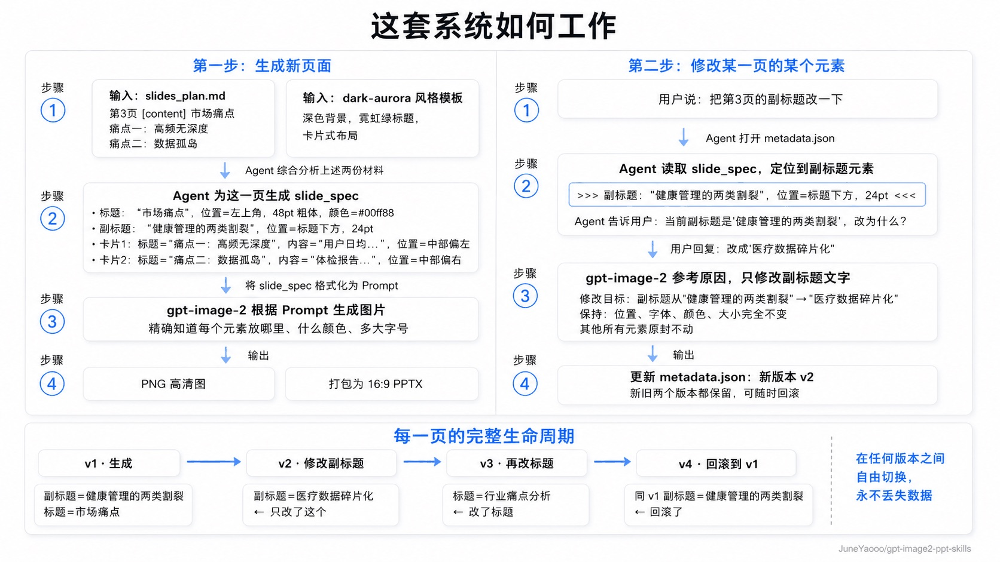

<div align="center">

# gpt-image2-ppt-skills

**用 OpenAI `gpt-image-2` 一键生成视觉强烈的 PPT。**

Claude Code / Codex / OpenClaw Skill。装进 agent 后，用一句自然语言生成 16:9 高清图片 + 打包好的 `.pptx`，也可以仿任意 `.pptx` 模板出全新内容。

[](https://github.com/JuneYaooo/gpt-image2-ppt-skills/stargazers)
[](./LICENSE)
[](https://www.python.org/)
[](https://www.anthropic.com/claude-code)
[](https://platform.openai.com/docs/guides/images)

🌐 **English** → [docs/README.en.md](./docs/README.en.md)

</div>

---

## 🎬 效果演示：喂一张模板，仿出一套新内容

<table>
<tr>
<th width="50%">输入：任意一页参考模板（.pptx / 图片）</th>
<th width="50%">输出：本 skill 仿制 + 换内容</th>
</tr>
<tr>
<td></td>
<td></td>
</tr>
<tr>
<td align="center"><sub>英文信息图模板（Mass Media Infographics）</sub></td>
<td align="center"><sub>同一版式 / 同一配色 / 同一插画语汇，内容换成「普通人怎么用 AI 做自媒体」</sub></td>
</tr>
</table>

---

## ✨ 能做什么

- 🎨 **十套精选风格** — Spatial Glass / Tech Blue / Editorial Mono / Dark Aurora / Riso / Wabi / Swiss Grid / Hand Sketch / Y2K Chrome / Vector Illustration，每套都细分 `cover` / `content` / `data` 三种构图
- 🪄 **模板克隆模式** — 丢一个 `.pptx` 进去，AI 会参考原模板的版式、配色和插画语汇，像上面那张图一样换成新内容
- 🎯 **自然语言改 PPT** — 直接说“改第 3 页副标题”“删掉页脚”“把三个数据换成新数字”，AI 会只重生成目标页
- 🎮 **双产出** — 每页 PNG 高清原图 + 16:9 `.pptx` 直接用
- ⚡ **默认 10 路并发出图** — 10 页 ~30 秒出完
- 🧪 **先看一页再跑全量** — 默认建议先出封面给你确认，满意后再生成整套
- 🧾 **可追踪、可回滚** — 修改过哪些页、生成过哪些版本都能追踪，方便继续改

## ✅ 适合哪些用户场景

| 场景 | 适合程度 | 说明 |
| --- | --- | --- |
| 从主题生成一套新 PPT | 很适合 | 适合汇报、路演、培训、课程、产品介绍。 |
| 按公司模板仿一套新内容 | 很适合 | 上传 `.pptx` 模板，先出封面确认，再跑全量。 |
| 改标题、副标题、日期、页脚 | 很适合 | 当前最稳定的编辑场景。 |
| 更新数据卡片和关键数字 | 适合 | 可批量改，但交付前要逐项核对数字。 |
| 只改复杂多页 PPT 的某一页 | 适合 | 只更新目标页，其他页不重新生成。 |
| 密集表格、财报、法务长文 | 不建议直接承诺 | 小字和数字需要更严格人工验收。 |

## 🎨 十种内置风格

> 下图为 10 套风格在同一主题「**如何用 gpt-image-2 做 PPT**」下各生成一张封面的对照。全部由 `gpt-image-2` 直出，未经 PS。


| 风格 ID | 一句话定位 | 适用场景 |
| --- | --- | --- |
| `gradient-glass` | Apple Vision OS / Spatial Glass | AI 产品发布、技术分享、创意提案 |
| `clean-tech-blue` | Stripe / Linear 级蓝白 | 融资路演、商业计划书、企业战略 |
| `vector-illustration` | 复古矢量插画 + 黑描边 | 教育培训、品牌故事、社区分享 |
| `editorial-mono` | Kinfolk / Monocle 编辑设计 | 品牌发布、文化访谈、读书分享 |
| `dark-aurora` | Linear / Vercel 深色霓虹 | AI 产品、开发者工具、技术分享 |
| `risograph` | Riso 双套色印刷 + 网点纹理 | 创意工作室、文创品牌、独立 zine |
| `japanese-wabi` | 无印 / 原研哉式侘寂 | 茶道、生活方式、奢侈品、文化讲座 |
| `swiss-grid` | Bauhaus / Vignelli 国际主义网格 | 学术报告、博物馆展陈、严肃汇报 |
| `hand-sketch` | Sketchnote / 白板手绘 | 工作坊、产品 brainstorming、培训 |
| `y2k-chrome` | Y2K 千禧液态金属 + 蝴蝶贴纸 | 潮牌、文娱、品牌联名、Z 世代营销 |

---

## 🧪 修改能力测评

如果你关心“到底能不能稳定改 PPT”，先看这份面向用户的图文测评：

- **[`docs/edit_guide.md`](./docs/edit_guide.md)** — 标题替换、日期修改、删除页脚、数据更新、新增 logo、复杂多页只改一页，以及当前不足和交付前检查清单

核心结论：

| 能力 | 当前表现 |
| --- | --- |
| 改短文本 | 稳定，适合日常交付。 |
| 改多个明确元素 | 可用，建议一次说清楚“其他不要动”。 |
| 改数据页 | 可用，但必须核对数字。 |
| 加小图标 / logo | 可用；真实品牌 logo 需要提供素材。 |
| 原生 PPT 对象级编辑 | 暂不支持，当前 PPTX 是整页图片。 |

<details>
<summary>开发者：查看内部编辑机制示意图</summary>



</details>

---

## 🚀 安装

### 方式一：让 AI 自己装（推荐）

把下面这段 prompt 丢给你的 AI 助手（Claude Code / OpenClaw / Codex / Cursor / Trae / Hermes Agent 都行），它会自动完成安装：

```
帮我安装 gpt-image2-ppt-skills：
https://raw.githubusercontent.com/JuneYaooo/gpt-image2-ppt-skills/main/docs/install.md
```

agent 会自己 clone 仓库、按当前运行环境选择安装目标、提示你重启。

### 方式二：手动安装

```bash
git clone git@github.com:JuneYaooo/gpt-image2-ppt-skills.git
cd gpt-image2-ppt-skills
bash install_as_skill.sh --target claude   # Claude Code
# 或
bash install_as_skill.sh --target codex    # Codex
```

脚本会把 skill 装到对应 agent 的目录：

- Claude Code: `~/.claude/skills/gpt-image2-ppt-skills/`
- Codex: `~/.codex/skills/gpt-image2-ppt-skills/`

如果你走 API 直连模式，需要给 agent 注入环境变量。推荐使用当前 agent 框架的标准配置，而不是把密钥写进业务项目根目录 `.env`：

- Claude Code：用户级 `~/.claude/settings.json`，或项目级 `.claude/settings.local.json`
- OpenClaw / 自定义 Agent：用 `apiKey` / env reference 引用系统环境变量
- CI / 服务器：用系统环境变量、Docker Compose、Kubernetes Secret 或 CI Secret
- standalone CLI：可设置 `GPT_IMAGE2_PPT_ENV=/path/to/private.env`，或使用 skill 安装目录下的 `.env` fallback

```bash
# 变量名如下：
OPENAI_BASE_URL=https://api.openai.com    # 或任意 OpenAI 兼容中转
OPENAI_API_KEY=sk-...                     # 必需
GPT_IMAGE_MODEL_NAME=gpt-image-2
GPT_IMAGE_QUALITY=high                    # low / medium / high / auto
```

> 在 **Codex** 里如果当前 agent 自带原生图片生成能力，可以直接走 `SKILL.md` 里的原生路径，**不必配置 `OPENAI_API_KEY`**。
>
> 🔒 **不会误吃密钥**：脚本只读取当前进程环境、平台注入变量、显式 `GPT_IMAGE2_PPT_ENV` 和 skill 安装目录 `.env` fallback，**不会**向上递归读调用者项目目录的 `.env`。
>
> 🪄 模板克隆模式额外需要本机 `libreoffice`（用来把 `.pptx` 渲染成 PNG）。

### 模板克隆的 Vision 分析（可选）

模板克隆模式下，skill 需要先"看懂"你的 `.pptx` 模板的视觉风格。**如果你的 AI 助手本身就是多模态的**（Claude Code 走 Claude Opus/Sonnet，Codex 走 GPT 多模态等），agent 会直接自己看图抽取风格，生成带 `reference_image` 的 `template_profile.json` 后通过 `--template-profile` 传给 CLI，**不需要额外配置**。

只有当你用的 agent 是纯文本模型时（例如只接入 DeepSeek 文本模型），才需要配下面这组环境变量，走一个独立的多模态模型来分析模板：

```bash
# 可选：模板克隆的 vision 分析（仅纯文本 agent 需要，多模态 agent 不用配）
VISION_BASE_URL=https://your-openai-compatible-relay.example.com/v1
VISION_API_KEY=sk-...
VISION_MODEL_NAME=gemini-3.1-pro-preview   # 或 gpt-4o / claude-3.5-sonnet 等任意多模态 SKU
```

> 支持任意兼容 OpenAI `/v1/chat/completions` 格式的多模态模型（Gemini / GPT-4o / Claude 等），与图片生成的 `gpt-image-2` 完全解耦——换 vision provider 不影响出图。

---

## 🛠 在 Claude Code 里怎么用

装完直接跟 Claude 说人话就行：

> 帮我用 **gpt-image2-ppt** 生成一份关于 **[你的主题]** 的 5 页 PPT，风格用 `dark-aurora`。

仿模板同理：

> 我这有一个 `company-template.pptx`，帮我按这个模板做一份关于 **[你的主题]** 的 5 页 PPT。

Claude 会自己写 `slides_plan`、先出一页封面让你确认、再跑全量，把输出目录和 `.pptx` 路径告诉你。

> 想自己写脚本调 CLI 而不走 agent？看 [`SKILL.md`](./SKILL.md)，CLI 参数、文件布局都在那。

---

## 📚 更多文档

- **[`docs/edit_guide.md`](./docs/edit_guide.md)** — 面向非程序员的 PPT 修改能力测评、案例、总结和当前不足
- **[`docs/workflow.md`](./docs/workflow.md)** — 开发者文档：CLI 分发、生成 / 编辑 / 回滚 / 摄取外部 PPTX、版本链和数据安全机制
- **[`SKILL.md`](./SKILL.md)** — Agent 执行规格：生成流程、模板克隆、Codex 原生路径、编辑工作流和命令参考

---

## 🙏 致谢

- [op7418/NanoBanana-PPT-Skills](https://github.com/op7418/NanoBanana-PPT-Skills) — 风格 prompts 与早期 skill 结构参考。本项目把图片后端从 Nano Banana Pro 换成了 OpenAI gpt-image-2，重写了继承自上游的 3 套风格并新增 7 套（共 10 套），另加入模板克隆模式（vision 抽风格仿任意 `.pptx`）、md-first 编排流程、`.pptx` 自动打包、codex CLI 备用后端等新功能。
- [lewislulu/html-ppt-skill](https://github.com/lewislulu/html-ppt-skill) — Claude Code skill SKILL.md frontmatter 写法参考。

## 💬 Community

[**LINUX DO — 中文开发者社区**](https://linux.do/)

### 微信交流群

欢迎大家有问题一起交流讨论。


## ⭐ Star History

[](https://star-history.com/#JuneYaooo/gpt-image2-ppt-skills&Date)

---

## License

Apache License 2.0，详见 [LICENSE](./LICENSE)。
