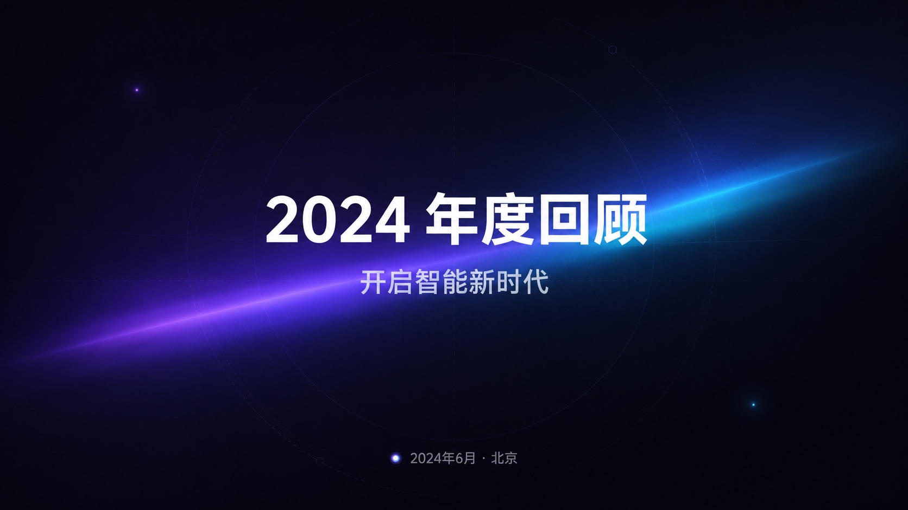
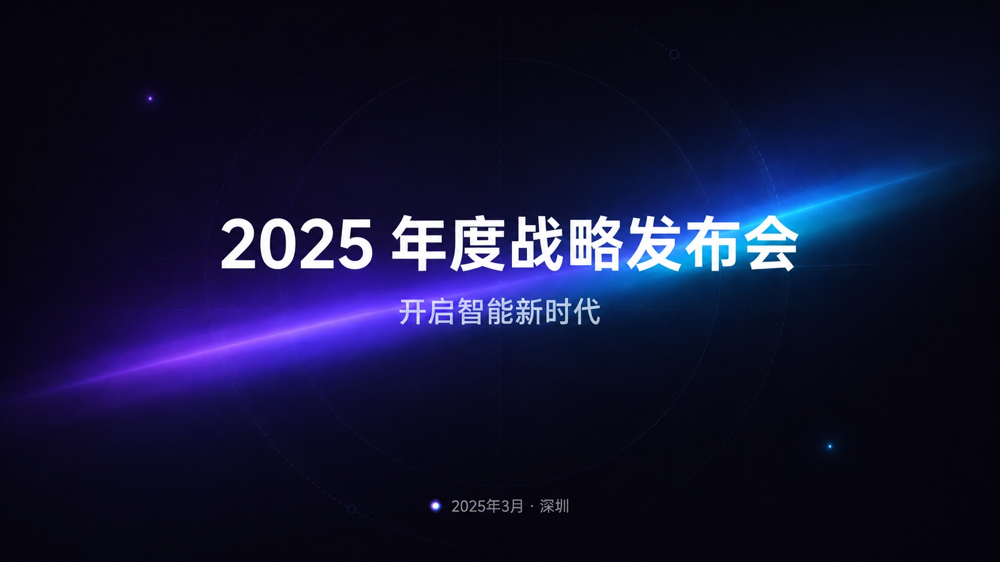
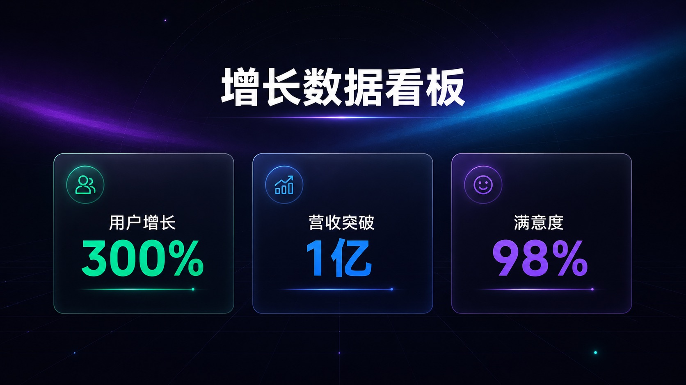
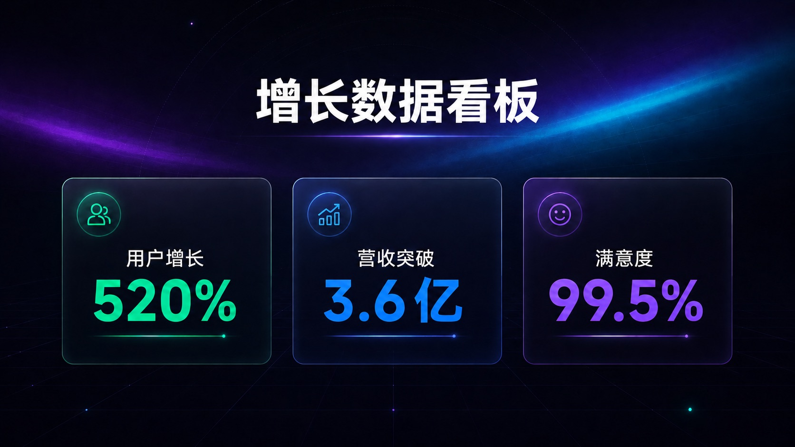
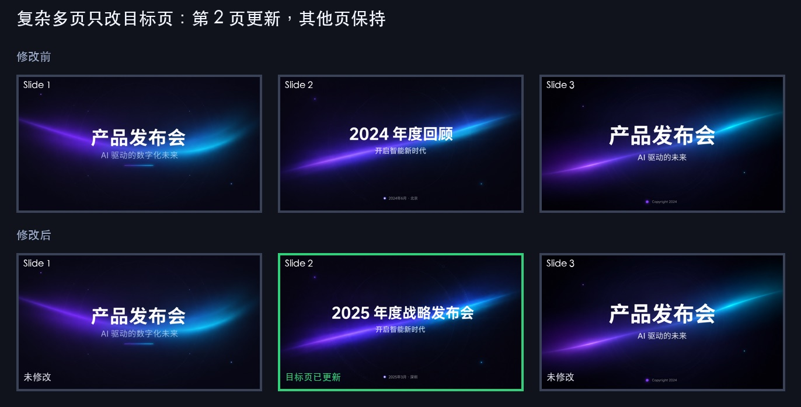

# gpt-image2-ppt：PPT 修改能力测评与使用建议


## 一句话结论

`gpt-image2-ppt` 适合用自然语言修改 PPT 的视觉结果，例如改标题、换副标题、更新日期、删页脚、改数据卡片、给某页加小标识。它会把目标页重新生成成一张高质量 16:9 图片，再打包进 PPTX。

需要说清楚的是：它不是 PowerPoint 原生对象编辑工具。用户不能指望像手动点选文本框那样做到 100% 对象级、像素级不变；重要交付前仍然要人工看一遍。

---

## 用户最关心什么

| 用户关心的问题 | 当前回答 |
| --- | --- |
| 能不能直接说人话改 PPT？ | 可以，例如“把第 3 页标题改成年度战略复盘，其他不要动”。 |
| 常见文字修改稳不稳？ | 标题、副标题、日期、页脚这类短文本最稳定。 |
| 能不能只改某一页？ | 可以，复杂多页 PPT 里可以只更新指定页，其他页不重新生成。 |
| 能不能改数据页？ | 可以改多个指标，但数字类页面必须逐项复核。 |
| 能不能改别人的 PPT 模板？ | 可以先导入或仿模板，但越要求像素级一致，越需要人工验收。 |
| 交付物是什么？ | 每页高清 PNG、16:9 PPTX，以及生成过程记录。 |

---

## 场景能力总览

| 场景 | 稳定性 | 建议 |
| --- | --- | --- |
| 改标题 / 副标题 / 日期 / 地点 | 高 | 适合直接使用，也是最推荐的修改场景。 |
| 同时改多处短文本 | 高 | 一次说清楚所有改动，并补一句“其他不要动”。 |
| 删除页脚、小标签、小文本 | 中高 | 通常可用，但要看删除区域是否有轻微重绘痕迹。 |
| 更新数据卡片和关键数字 | 中高 | 可用，但必须逐项核对数字、单位和位置。 |
| 新增 logo / 图标 / 小标识 | 中 | 适合生成风格化小标识；真实品牌 logo 需要提供明确素材。 |
| 模板克隆后局部修改 | 中 | 可用，但要检查是否偏离原模板风格。 |
| 密集表格、财务报表、合同长文 | 低 | 不建议直接承诺，容易出现小字和数字误差。 |
| 原生 PPT 对象级编辑 | 不支持 | 当前 PPTX 以整页图片形式交付。 |

---

## 场景 1：只修改封面标题

用户需求：

```text
把标题改成「年度战略复盘」，其他所有内容、布局、配色、装饰都不要动。
```

| 修改前 | 修改后 |
| --- | --- |
|  |  |

测评结果：

| 检查项 | 结果 |
| --- | --- |
| 标题更新 | 通过，主标题已替换。 |
| 副标题保持 | 通过，副标题未被误改。 |
| 布局保持 | 通过，居中排版和视觉重心保持。 |
| 背景装饰保持 | 通过，整体风格一致。 |

结论：单个短文本替换是最稳定的场景，适合对外演示和日常交付。

---

## 场景 2：同时修改标题和底部日期

用户需求：

```text
标题改成「2025 年度战略发布会」，
底部日期改成「2025年3月 · 深圳」，
其他都不要动。
```

| 修改前 | 修改后 |
| --- | --- |
|  |  |

测评结果：

| 检查项 | 结果 |
| --- | --- |
| 标题更新 | 通过。 |
| 日期地点更新 | 通过。 |
| 副标题保持 | 通过。 |
| 背景和构图保持 | 通过。 |

结论：一次修改多个清晰文本元素可行。用户最好把要改的内容列完整，并说明哪些内容不能动。

---

## 场景 3：删除底部版权文字

用户需求：

```text
底部那行 Copyright 字样去掉，其他都不要动。
```

| 修改前 | 修改后 |
| --- | --- |
|  |  |

测评结果：

| 检查项 | 结果 |
| --- | --- |
| 版权文字删除 | 通过。 |
| 标题和副标题保持 | 通过。 |
| 背景保持 | 通过。 |
| 主体构图保持 | 通过。 |

结论：删除小文本可用，但比单纯替换文字略有风险，因为删除区域需要重新补背景。

---

## 场景 4：批量更新数据指标

用户需求：

```text
只更新三张数据卡片里的文字：
左侧改成「用户增长 520%」，
中间改成「营收突破 3.6亿」，
右侧改成「满意度 99.5%」。
标题、卡片位置、颜色、背景、装饰都不要动。
```

| 修改前 | 修改后 |
| --- | --- |
|  |  |

测评结果：

| 检查项 | 结果 |
| --- | --- |
| 左侧指标更新 | 通过。 |
| 中间指标更新 | 通过。 |
| 右侧指标更新 | 通过。 |
| 标题保持 | 通过。 |
| 三列卡片结构保持 | 通过。 |

结论：数据页可以批量改，但数据是用户最敏感的部分。正式交付前必须逐项核对数字、单位、小数点和百分号。

---

## 场景 5：右上角新增 logo

用户需求：

```text
在右上角增加一个简洁的科技公司 logo 图标，
大小约占页面宽度的 7%，不要遮挡标题和副标题。
其他文字、背景、布局、配色、装饰都不要动。
```

| 修改前 | 修改后 |
| --- | --- |
|  |  |

测评结果：

| 检查项 | 结果 |
| --- | --- |
| logo 新增 | 通过，右上角出现小标识。 |
| 不遮挡主文案 | 通过。 |
| 标题和副标题保持 | 通过。 |
| 背景构图保持 | 通过。 |

结论：新增小型视觉元素可用。注意：如果用户需要真实公司 logo，不应该只靠文字描述生成，而应提供 logo 素材。

---

## 复杂多页：只修改某一页

用户经常会问：“我有一整套 PPT，只想改第 7 页，会不会影响其他页？”

当前结论：可以只更新指定页。下面的多页证据图展示了修改前后只有第 2 页发生变化，第 1 页和第 3 页保持原样。

<p align="center">
  
</p>

| 检查项 | 结果 |
| --- | --- |
| 目标页更新 | 通过。 |
| 其他页保持 | 通过。 |
| 页序保持 | 通过。 |
| 适合复杂多页 PPT | 适合，但目标页本身仍需人工验收。 |

---

## 用户可以怎么说

用户不需要懂命令、JSON 或内部结构。直接这样说就够了：

| 用户说法 | 适合程度 |
| --- | --- |
| “把封面标题改成年度战略复盘，其他不要动。” | 很适合 |
| “第 2 页底部日期改成 2025 年 3 月，地点改成深圳。” | 很适合 |
| “把第 5 页三个数据改成这三个新数字。” | 适合，但要核对数字 |
| “删掉每页底部版权文字。” | 适合，建议逐页检查 |
| “右上角加一个我们公司 logo。” | 需要提供 logo 图片素材 |
| “整套完全按原品牌手册像素级复刻。” | 不建议直接承诺 |

---

## 当前不足

| 不足 | 对用户的影响 | 建议说法 |
| --- | --- | --- |
| 输出 PPTX 是整页图片 | 在 PowerPoint 里不能直接点选文字框继续编辑。 | “适合直接展示和分享；如果要原生可编辑对象，需要后续增强。” |
| 生成式编辑可能有轻微漂移 | 背景纹理、字体细节、图标形态可能和原图不完全一致。 | “我会尽量保持不变，但交付前需要看一遍效果。” |
| 数字和小字需要复核 | 数据页、表格页、密集文字页对准确性要求高。 | “我可以改，但你需要重点检查数字和小字。” |
| 外部 PPTX 初次导入不等于完全可精确编辑 | 需要先让 AI 看图理解每页有哪些元素。 | “可以改，但复杂模板建议先做一页测试。” |
| 真实 logo / 品牌资产不能只靠描述 | 模型会生成相似风格的小图标，不一定是真实 logo。 | “请提供 logo 文件，我再放入或参考它生成。” |
| 像素级品牌一致性不稳定 | 对严格企业模板、法务文件、财报不适合作无条件承诺。 | “这类场景需要模板测试和人工验收。” |

---

## 交付前检查清单

| 检查项 | 为什么重要 |
| --- | --- |
| 标题、副标题是否正确 | 这是最显眼的错误来源。 |
| 数字、单位、百分号、小数点是否正确 | 数据页最容易被用户追责。 |
| 有没有误改其他文字 | 生成式编辑可能影响相邻区域。 |
| logo、图标是否符合品牌要求 | 真实品牌资产需要格外检查。 |
| PPTX 页面比例是否为 16:9 | 避免投影或会议屏幕变形。 |
| 是否只修改了用户指定页 | 多页交付前快速翻一遍。 |

---

## 最终总结

`gpt-image2-ppt` 已经适合覆盖大多数“让 AI 帮我改 PPT 视觉结果”的需求，尤其是标题、日期、短文案、页脚、数据卡片、局部小元素这类明确修改。

当前不适合承诺的是：PowerPoint 原生对象级编辑、复杂表格逐字零误差、严格品牌模板像素级一致、未提供真实素材却要求真实 logo。

最稳的使用方式是：先让用户用自然语言说清楚要改哪一页、改什么、哪些不动；先测一页确认风格，再批量处理；交付前按检查清单快速验收。
